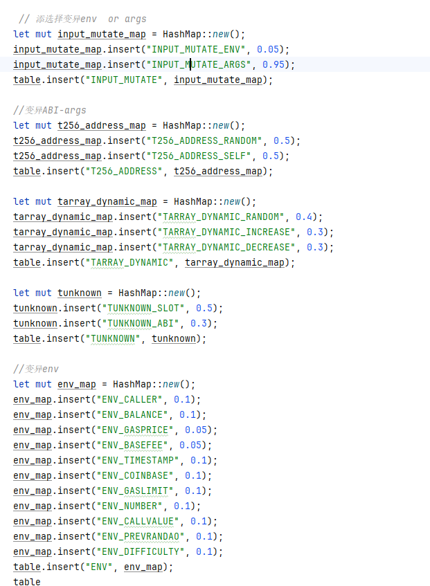

### 1.定义并补充变异操作：包括三个层面
      1 函数参数
      2 tx顺序==state 快照
      3 环境参数：
        -包括：调用者（caller）、余额（balance）、交易值（txn_value）、gas价格（gas_price）、基础费用（basefee）、时间戳（timestamp）、coinbase、gas限制（gas_limit）、区块号（number）和prevrandao。 ）
        -3个没有实现：balance prevrandao gas_price:变异机制暂定，原值*（0-2）
        -增加difficulty
        -其他：gas_price 越高，交易越快得到处理。。貌似在离线测试没有影响gas_price.是由两部分组成的：基本费用（由协议自动计算）和优先费用（由用户输入）。基本费用根据网络拥堵情况而变化，优先费用由用户决定）
### 2.定义变异概率表PTable
    随机生成概率值 or 均等概率值 or 自定义值

### 3.反馈信息
    Is_triggered：{0,1}
    Cov:{有符号double值}，项目中有instruction_coverage和branch_coverage,但是项目有计算bug
    Is_datawaypoints_interesting：{0，1}
    Is_comparisonwaypoint_interesting：{0，1}
    Is_instructions_interesting：{0，1}//关键指令如状态变量的写入（SSTORE）、外部调用（CALL、CALLCODE、DELEGATECALL）和自毁（SELFDESTRUCT），就认为是有价值的

### 4.循环以下步骤
    结束条件：到达迭代次数 or 找到bug
    1.选择变异器：大部分时候直接选取最大概率的mutator，同时保留一定的随机性，一定概率p下进行随机选择（ p值得选取先大后小）
    2.选择种子：源代码已有选择机制
    3.变异：
    4.执行
    5.收集反馈信息
    6.计算价值并更新PTable

##### 1)价值计算公式：
      value = A*Is_triggered + B*Cov_diff + C*Is_datawaypoints_interesting + D*Is_comparisonwaypoint_interesting + E*Is_instructions_interesting
      [(1,1,1,1,1),(3,2,1,1,1),(5,3,2,2,1)]
##### 2)PTable更新
    - y>VALUE>x，增加概率10%
    - 0<VALUE<x，增加概率5%
    - z<VALUE<0，不变
    - VALUE<z，减少概率5%
##### 3)超参数：
p：随机的概率
A,B,C,D, E：价值计算公式的超参数
x,y,z：更新PTable的超参数