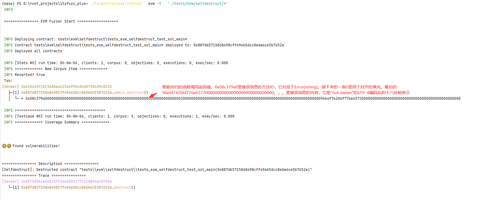

### 1. evm/mod.rs

#### 1. EvmArgs存储EVM命令行参数
#[derive(Parser, Debug)]：这是一个Rust属性。Parser trait使得EvmArgs可以从命令行参数中解析出来，Debug trait使得EvmArgs可以被打印出来
target: 要查找合约的glob模式或地址  
fetch_tx_data: 表示是否获取交易数据
proxy_address: 用于存储代理地址
constructor_args：存储构造函数的参数。  
目标类型："glob"：表示target参数是一个glob模式，用于匹配文件系统中的文件路径。"address"：表示target参数是一个以太坊地址，用于指定一个特定的智能合约。"anvil_fork"：表示使用Anvil进行分叉，target参数应为要分叉的合约地址列表。"config"：表示从配置文件中加载合约。"setup"：表示从设置文件中加载合约
链类型
块号
RPC端点URL
链ID
块浏览器URL
链名
Etherscan API密钥
存储获取方式
是否启用符号执行
是否支持将调用者视为符号
符号执行的时间限制、
符号执行的线程数、
是否启用闪电贷、
是否在调用typed_bug()时发生恐慌、
启用的检测器、
是否重放、
工作目录、
是否写入合约关系、
是否在找到错误时继续运行、
随机种子：随机种子是一个数字，它用于初始化随机数生成器。在模糊测试中，随机种子用于生成随机的输入数据。如果在两次测试中使用相同的随机种子，那么将会生成相同的随机输入数据。这对于复现和调试问题非常有用，因为它允许我们重现相同的测试条件
是否绕过所有SHA3比较、
只模糊具有地址的合约、
基路径、
规范ID、
构建器URL、
链上替换配置文件、
构建器工件URL、
构建器工件文件、
链下配置URL、
链下配置文件、
从目录加载语料库、
设置文件、
部署脚本合约、
强制合约使用给定的ABI、
预设文件路径、
基目录、
构建合约的命令。

#### 2. 传下去的config参数

这段代码中的`Config`是一个结构体实例，它包含了一些配置参数。以下是每个字段的含义：
- `contract_loader`：这是一个`ContractLoader`实例，用于加载和处理智能合约。
- `only_fuzz`：这是一个地址集合，只有这些地址的合约会被模糊测试。
- `onchain`：这是一个`Option<OnChainConfig>`类型，用于配置链上的信息，如链类型、区块号等。
- `concolic`：这是一个布尔值，表示是否启用符号执行。
- `concolic_caller`：这是一个布尔值，表示是否支持将调用者视为符号。
- `concolic_timeout`：这是一个整数，表示符号执行的时间限制。
- `concolic_num_threads`：这是一个整数，表示符号执行的线程数。
- `oracle`：这是一个`Oracle`实例的集合，用于检测智能合约的漏洞。
- `producers`：这是一个`Producer`实例的集合，用于生成模糊测试的输入。
- `flashloan`：这是一个布尔值，表示是否启用闪电贷。
- `onchain_storage_fetching`：这是一个`Option<StorageFetchingMode>`类型，用于配置链上存储的获取方式。
- `replay_file`：这是一个`Option<String>`类型，表示重放文件的路径。
- `flashloan_oracle`：这是一个`IERC20OracleFlashloan`实例，用于检测ERC20闪电贷的漏洞。
- `selfdestruct_oracle`：这是一个布尔值，表示是否启用自毁合约的检测。
- `reentrancy_oracle`：这是一个布尔值，表示是否启用重入攻击的检测。
- `work_dir`：这是一个字符串，表示工作目录的路径。
- `write_relationship`：这是一个布尔值，表示是否将合约关系写入文件。
- `run_forever`：这是一个布尔值，表示是否在找到错误时继续运行。
- `sha3_bypass`：这是一个布尔值，表示是否绕过所有SHA3比较。
- `base_path`：这是一个字符串，表示基路径。
- `echidna_oracle`：这是一个布尔值，表示是否启用Echidna检测器。
- `invariant_oracle`：这是一个布尔值，表示是否启用不变性检测。
- `panic_on_bug`：这是一个布尔值，表示是否在调用`typed_bug()`时发生恐慌。
- `spec_id`：这是一个字符串，表示规范ID。
- `typed_bug`：这是一个布尔值，表示是否启用类型错误的检测。
- `arbitrary_external_call`：这是一个布尔值，表示是否启用任意外部调用的检测。
- `math_calculate_oracle`：这是一个布尔值，表示是否启用数学计算错误的检测。
- `builder`：这是一个`Option<BuildJob>`类型，用于配置构建任务。
- `local_files_basedir_pattern`：这是一个`Option<String>`类型，表示本地文件的基目录模式。
- `preset_file_path`：这是一个字符串，表示预设文件的路径。
- `load_corpus`：这是一个字符串，表示语料库的加载路径。

#### 3. state参数
FuzzState——where     
VS: Default + VMStateT,     
VI: VMInputT<VS, Loc, Addr, CI> + Input,     
Addr: Debug + Serialize + DeserializeOwned + Clone,     
Loc: Debug + Serialize + DeserializeOwned + Clone,     
Out: Default + Into<Vec<u8>> + Clone,     
CI: Serialize + DeserializeOwned + Debug + Clone + ConciseSerde,
The global state of ItyFuzz, containing all the information needed for fuzzing Implements LibAFL's State trait and passed to all the fuzzing components as a reference
VI: The type of input VS: The type of VMState Loc: The type of the call target Addr: The type of the address (e.g., H160 address for EVM) Out: The type of the output
EVMFuzzState = FuzzState<EVMInput, EVMState, EVMAddress, EVMAddress, Vec<u8>, ConciseEVMInput>

### 2. evm_fuzzer.rs

* infant_scheduler——SortedDroppingScheduler————"基于投票机制丢弃输入（或VMState）的调度器"
* scheduler——PowerABIScheduler 对象，用于管理和调度模糊测试过程中的任务。作用是决定下一步要执行哪个输入或者测试用例，以及如何生成新的输入或者测试用例
* executor——evm_executor——EVM executor, wrapper of revm
* artifacts——corpus_initializer————"corpus初始化器"，可能包含了一些在模糊测试中需要的信息，例如合约的字节码、ABI、初始状态等
* instance_map——— ABI instance map from address，根据合约地址快速找到对应的合约实例
* meta——将构建工件添加到元数据中，以便后续的代码可以根据地址快速查找到这些工件
* cov_middleware——将每个合约的字节码添加到覆盖率中间件中，以便后续的代码可以根据地址快速查找到这些字节码
* feedback = MaxMapFeedback::new(&jmp_observer)——可能是用来观察和记录程序中的跳转指令的
* concolic_stage——符号执行阶段。在这个阶段中，将使用符号执行的方法来执行智能合约的代码，以寻找可能的错误或漏洞。
* std_stage——mutator——可能是一个阶段，用于执行模糊测试的某个特定步骤，例如变异输入
* state.metadata_map_mut().insert(UncoveredBranchesMetadata::new());可能用于跟踪和记录未覆盖的代码分支
* coverage_obs_stage——覆盖率观察阶段
* #[cfg(feature = "deployer_is_attacker")]——如果在编译时启用了 "deployer_is_attacker" 特性（例如，通过在编译命令中添加 --features deployer_is_attacker），那么这段代码就会被编译并执行。这段代码的作用是将 deployer 添加到状态的调用者列表中。这可能意味着在模糊测试或其他类型的测试中，deployer 被视为可能的攻击者。
* infant_feedback——CmpFeedback—
* infant_result_feedback——DataflowFeedback
* objective——OracleFeedback 对象，该对象用于在模糊测试过程中提供反馈
* wrapped_feedback—— ConcolicFeedbackWrapper 对象，该对象用于在模糊测试过程中提供反馈
* testcases——从指定的文件或目录中加载测试用例，并将其反序列化为 ConciseEVMInput 对象，然后将这些对象存储在 testcases 向量中。因此包含了从所有文件中加载的所有测试用例。
* load_code宏——加载给定的合约代码到 EVM 执行环境中。
* None => 执行模糊测试，否则执行回放测试

中间件（middleware）：
1. `Cheatcode`：这个中间件应该是第一个添加的，因为如果步骤是调用 `cheatcode_address`，那么这个步骤将被 "消耗"，并且对其他中间件不可见。
2. `OnChain`：如果配置中有 `onchain`，则会添加这个中间件。这个中间件用于处理链上的操作。
3. `Flashloan`：如果配置中启用了 `flashloan`，则会添加这个中间件。这个中间件用于处理闪电贷的操作。
4. `Sha3Bypass`：如果配置中启用了 `sha3_bypass`，则会添加这个中间件。这个中间件用于绕过 SHA3 的计算。
5. `ReentrancyTracer`：如果配置中启用了 `reentrancy_oracle`，则会添加这个中间件。这个中间件用于追踪重入攻击。
6. `Coverage`：这个中间件用于收集代码覆盖率信息。
7. `CallPrinter`：这个中间件用于打印调用信息。
   以上是在 `evm_fuzzer` 函数中直接添加的中间件，实际上还可能通过配置添加其他的中间件，例如 `ArbitraryCallOracle`、`TypedBugOracle`、`SelfdestructOracle`、`ReentrancyOracle` 等。具体添加哪些中间件取决于配置和运行时的条件。

3个阶段
1. `concolic_stage`：符号执行阶段。在这个阶段中，将使用符号执行的方法来执行智能合约的代码，以寻找可能的错误或漏洞。
2. `std_stage`：模糊测试阶段。在这个阶段中，将使用模糊测试的方法来执行智能合约的代码，以寻找可能的错误或漏洞。
3. `coverage_obs_stage`：覆盖率观察阶段。在这个阶段中，将使用覆盖率观察的方法来执行智能合约的代码，以寻找可能的错误或漏洞。

6个oracles
1. `EchidnaOracle`：这个对象的构造函数接受两个参数：一个地址到 ABI 的映射，其中只包含函数名以 "echidna_" 开头且 ABI 为 "()" 的函数；一个函数签名到函数名的映射，其中只包含函数名以 "echidna_" 开头且 ABI 为 "()" 的函数。
2. `InvariantOracle`：这个对象的构造函数接受两个参数：一个地址到 ABI 的映射，其中只包含函数名以 "invariant_" 开头且 ABI 为 "()" 的函数；一个函数签名到函数名的映射，其中只包含函数名以 "invariant_" 开头且 ABI 为 "()" 的函数。
3. `ArbitraryCallOracle`：
4. `TypedBugOracle`：
5. `SelfdestructOracle`：
6. `ReentrancyOracle`：

4个反馈
1. wrapped_feedback,
2. infant_feedback,
3. infant_result_feedback,
4. objective,

#### 1）模糊测试函数：

`let mut vm_state = initial_vm_state.clone();`：克隆初始的虚拟机状态。
`for txn in testcase {`：遍历测试用例中的每个交易。
`load_code!(txn);`：加载交易中的合约代码。
`let (inp, call_until) = txn.to_input(vm_state.clone());`：将交易和当前的虚拟机状态转换为输入。
`unsafe { CALL_UNTIL = call_until; }`：设置全局变量 `CALL_UNTIL` 的值。
`fuzzer.evaluate_input_events(state, &mut executor, &mut mgr, inp, false).unwrap();`：使用模糊测试器评估输入。
`vm_state = state.get_execution_result().new_state.clone();`：更新虚拟机状态。
`let res = fuzzer.fuzz_loop(&mut stages, &mut executor, state, &mut mgr);`：执行模糊测试循环。
`let rv = res.err().unwrap().to_string();`：获取模糊测试循环的结果。
`if rv == "No items in No entries in corpus" {`：如果结果为 "No items in No entries in corpus"，则打印错误信息并退出。

#### 2）回放测试

`unsafe { EVAL_COVERAGE = true; }`：设置全局变量 `EVAL_COVERAGE` 的值为 `true`。
`let printer = Rc::new(RefCell::new(CallPrinter::new(artifacts.address_to_name.clone())));`：创建一个新的 `CallPrinter` 对象。
`evm_executor_ref.borrow_mut().host.add_middlewares(printer.clone());`：将 `CallPrinter` 对象添加到中间件列表中。
`for testcase in testcases {`：遍历所有的测试用例。
`let mut vm_state = initial_vm_state.clone();`：克隆初始的虚拟机状态。
`for txn in testcase {`：遍历测试用例中的每个交易。
`load_code!(txn);`：加载交易中的合约代码。
`let (inp, call_until) = txn.to_input(vm_state.clone());`：将交易和当前的虚拟机状态转换为输入。
`printer.borrow_mut().cleanup();`：清理 `printer` 对象。
`unsafe { CALL_UNTIL = call_until; }`：设置全局变量 `CALL_UNTIL` 的值。
`fuzzer.evaluate_input_events(state, &mut executor, &mut mgr, inp, false).unwrap();`：使用模糊测试器评估输入。
`vm_state = state.get_execution_result().new_state.clone();`：更新虚拟机状态。
`cov_middleware.borrow_mut().record_instruction_coverage();`：记录指令覆盖率。

### 3. fuzzer.rs
A fuzzer that implements ItyFuzz logic using LibAFL's [`Fuzzer`] trait

* VS: The VM state type
* Loc: The call target location type (e.g., H160)
* Addr: The address type (e.g., H160)
* Out
* CS: The scheduler for the input corpus
* IS: The scheduler for the infant state corpus
* F: The feedback for the input corpus (e.g., coverage map)/////wrapped_feedback,
* IF: The feedback for the input state and execution result in infant state (e.g., comparison, etc.)////infant_feedback,
* IFR: The feedback for the resultant state to be inserted into infant state/// corpus (e.g., dataflow, etc.)////infant_result_feedback,
* I: The VM input type
* OF: The objective for the input corpus (e.g., oracles) ~~////oracle feedback~~
* S: The fuzzer state type
* OT
* CI
* SM
* minimizer_map——"从测试用例的哈希映射（例如，覆盖率图）到（测试用例索引，喜好因子）用于最小化语料库"

##### 1)evaluate_input_events函数

* `start_timer!(state);`：这行代码启动了一个计时器，用于测量代码执行的时间。
* `executor.observers_mut().pre_exec_all(state, &input)?;`：这行代码调用了所有的观察者的pre_exec_all方法，这个方法在执行输入之前被调用，用于设置或准备观察者。
* `mark_feature_time!(state, PerfFeature::PreExecObservers);`：这行代码标记了PreExecObservers特性的执行时间。
* `let exitkind = executor.run_target(self, state, manager, &input)?;`：这行代码执行了目标代码，并返回了一个exitkind，表示执行的结果。
* `mark_feature_time!(state, PerfFeature::TargetExecution);`：这行代码标记了TargetExecution特性的执行时间。
* `*state.executions_mut() += 1;`：这行代码增加了执行次数的计数。
* `executor.observers_mut().post_exec_all(state, &input, &exitkind)?;`：这行代码调用了所有的观察者的post_exec_all方法，这个方法在执行输入之后被调用，用于收集观察者的数据。
* `mark_feature_time!(state, PerfFeature::PostExecObservers);`：这行代码标记了PostExecObservers特性的执行时间
* `let observers = executor.observers();`：这行代码获取了执行器的观察者。观察者是用来收集执行过程中的信息的，例如代码覆盖率、性能数据等。这些信息会被用来评估输入的价值。
* `let concise_input = input.get_concise(state.get_execution_result());`：这行代码获取了输入的简洁形式。get_concise方法可能会将输入转换为一种更简洁、更易于处理的形式。这个简洁的输入会被用来评估输入的价值。
* `let reverted = state.get_execution_result().reverted;`：这行代码获取了执行结果的reverted字段。reverted字段表示执行是否被回滚。在以太坊中，如果一个交易因为某种原因（例如，执行错误、超出了gas限制等）无法完成，那么它会被回滚，所有的状态改变都会被撤销。这个信息会被用来评估输入的价值。
* `let is_infant_interesting = self.infant_feedback.is_interesting(state, manager, &input, observers, &exitkind)?`;：这行代码使用 infant_feedback 对象来判断执行结果是否有趣。具体的判断逻辑取决于 infant_feedback 对象的实现。
* `let is_solution = self.objective.is_interesting(state, manager, &input, observers, &exitkind)?;`：这行代码使用 objective 对象来判断执行结果是否是一个解决方案。具体的判断逻辑取决于 objective 对象的实现。
* `let is_infant_solution = self.infant_result_feedback.is_interesting(state, manager, &input, observers, &exitkind)?;`：这行代码使用 infant_result_feedback 对象来判断执行结果是否应该添加到语料库中。具体的判断逻辑取决于 infant_result_feedback 对象的实现。
* `state.get_execution_result_mut().new_state.trace.from_idx = Some(input.get_state_idx());`：这行代码设置了新状态的追踪起始索引为当前输入的状态索引。
* `state.get_execution_result_mut().new_state.trace.derived_time = input.get_staged_state().trace.derived_time + 1;`：这行代码将新状态的追踪派生时间设置为当前输入的阶段状态的追踪派生时间加一。
* `state.get_execution_result_mut().new_state.trace.add_input(concise_input);`：这行代码将简洁的输入添加到新状态的追踪中。
* `let mut state_idx = input.get_state_idx();`：这行代码获取了当前输入的状态索引。
* `if is_infant_interesting && !reverted {...}`：这段代码判断如果当前的输入cmp是有趣的并且没有被回滚，那么就将新的虚拟机状态添加到婴儿状态语料库中。  
  `state_idx = state.add_infant_state(&state.get_execution_result().new_state.clone(), &mut self.infant_scheduler, input.get_state_idx());`：这行代码将新的虚拟机状态添加到婴儿状态语料库中，并更新状态索引。  
  `if self.infant_result_feedback.is_interesting(state, manager, &input, observers, &exitkind)? {...}`：这段代码判断如果当前的输入的dataflow结果是有趣的，那么就将状态索引赞助给婴儿调度器,赞助级别为3。
* `let mut res = ExecuteInputResult::None;`：这行代码初始化了一个 ExecuteInputResult 枚举，用于表示执行结果的类型。如果执行结果是有趣的或者是一个解决方案，那么这个枚举的值将会在后面的代码中被修改。
* `if is_solution && !reverted { res = ExecuteInputResult::Solution; } else { ... }`：这段代码根据 is_solution 的值和 reverted 的值来修改 res 的值。如果执行结果是一个解决方案并且没有发生回退，那么 res 的值将被设置为 ExecuteInputResult::Solution。
* `if is_corpus { res = ExecuteInputResult::Corpus; ... }`：这段代码根据 is_corpus 的值来修改 res 的值。如果执行结果应该添加到语料库中，那么 res 的值将被设置为 ExecuteInputResult::Corpus。
* #[cfg(feature = "print_txn_corpus")]：这是一个条件编译指令，只有在编译时启用了print_txn_corpus特性时，后面的代码块才会被编译和执行。
* `let corpus_dir = format!("{}/corpus"`, self.work_dir.as_str()).to_string();：这行代码创建了一个字符串corpus_dir，它是语料库的目录路径。这个路径由当前工作目录self.work_dir和子目录corpus拼接而成。
* `dump_file!(state, corpus_dir, true);：`这行代码调用了一个宏dump_file!，用于将当前的状态state打印并存储到corpus_dir指定的目录中。这个宏的第三个参数true表示在打印和存储状态时，会输出一些额外的调试信息
  *` let mut corpus_idx = CorpusId::from(0usize);`：这行代码初始化了一个语料库索引corpus_idx，初始值为0。
* `if res == ExecuteInputResult::Corpus || res == ExecuteInputResult::Solution {...}`：这段代码判断如果输入的结果是Corpus或者Solution，那么就将输入添加到语料库中。
  `let mut testcase = Testcase::new(input.clone());`：这行代码创建了一个新的测试用例testcase，它是输入的一个副本。
  `self.feedback.append_metadata(state, observers, &mut testcase)?;`：这行代码将观察者收集的元数据添加到测试用例中。
  `corpus_idx = state.corpus_mut().add(testcase)?;`：这行代码将测试用例添加到语料库中，并更新语料库索引。
  `self.infant_scheduler.report_corpus(state.get_infant_state_state(), state_idx);`：这行代码将新的语料库索引报告给婴儿调度器。
  `self.scheduler.on_add(state, corpus_idx)?;`：这行代码通知调度器，语料库中添加了一个新的测试用例。
  `self.on_add_corpus(&input, unsafe { &JMP_MAP }, corpus_idx.into());`：这行代码将新的测试用例添加到最小化映射中。
* `let final_res = match res {...}`：这行代码开始一个match表达式，根据res的值来决定执行哪个分支的代码。
* `ExecuteInputResult::None => {...}`：这个分支会在res的值为ExecuteInputResult::None时执行。这表示输入的执行结果并不是特别有趣，但是代码会检查是否应该因为更好的喜好因子来替换已有的语料库中的输入。  
  `self.objective.discard_metadata(state, &input)?;`：这行代码会丢弃输入的元数据。  
  `match self.should_replace(&input, unsafe { &JMP_MAP }) {...}`：这行代码开始一个新的match表达式，根据should_replace方法的返回值来决定执行哪个分支的代码。should_replace方法会检查是否应该因为新的输入有更高的喜好因子而替换语料库中的旧输入。  
  `Some((hash, new_fav_factor, old_testcase_idx)) => {...}`：这个分支会在should_replace方法返回Some时执行。这表示新的输入有更高的喜好因子，应该替换语料库中的旧输入。  
  `let testcase = Testcase::new(input.clone());`：这行代码创建了一个新的测试用例，它是输入的一个副本。  
  `let prev = state.corpus_mut().replace(old_testcase_idx.into(), testcase)?;`：这行代码将语料库中的旧输入替换为新的输入。  
  `self.infant_scheduler.report_corpus(state.get_infant_state_state(), state_idx);`：这行代码将新的语料库索引报告给婴儿调度器。  
  `self.scheduler.on_replace(state, old_testcase_idx.into(), &prev)?;`：这行代码通知调度器，语料库中的旧输入已被替换。  
  `self.on_replace_corpus((hash, new_fav_factor, old_testcase_idx), old_testcase_idx);`：这行代码更新最小化映射。  
  `None => {...}`：这个分支会在should_replace方法返回None时执行。这表示新的输入的喜好因子并没有旧的输入高，不应该替换语料库中的旧输入。  
  `self.feedback.discard_metadata(state, &input)?;`：这行代码会丢弃输入的元数据。
* `ExecuteInputResult::Corpus => {...}`：这个分支会在res的值为ExecuteInputResult::Corpus时执行。这表示输入的执行结果是有趣的，应该将输入添加到语料库中。  
  `self.objective.discard_metadata(state, &input)?;`：这行代码会丢弃输入的元数据。  
  `if send_events {...}`：这个if语句会在send_events为真时执行。这表示应该发送事件。  
  `let observers_buf = if manager.configuration() == EventConfig::AlwaysUnique {...}`：这行代码创建了一个观察者缓冲区。如果管理器的配置是AlwaysUnique，那么观察者缓冲区将为None，否则将序列化观察者。  
  `manager.fire(state, Event::NewTestcase {...})?`;：这行代码触发了一个新的测试用例事件。
* `ExecuteInputResult::Solution => {`：这行代码开始一个分支，当输入的执行结果是一个解决方案时，执行这个分支的代码。  
  `state.metadata_map_mut().get_mut::<BugMetadata>().unwrap().register_corpus_idx(corpus_idx.into());`：这行代码将当前的语料库索引注册到漏洞元数据中。  
  `let minimized = self.sequential_minimizer.minimize(...);`：这行代码使用顺序最小化算法来最小化输入，以便找到最小的能够触发漏洞的输入。  
  `let txn_text = prettify_concise_inputs(&minimized);`：这行代码将最小化后的输入转换为易读的文本格式。  
  `let txn_json = minimized.iter().map(...).join("\n");`：这行代码将最小化后的输入转换为JSON格式。
  `let cur_report = format!(...);`：这行代码生成了一个报告，包含了漏洞的描述和触发漏洞的输入的追踪信息。  
  `solution::generate_test(cur_report.clone(), minimized);`：这行代码生成了一个测试用例，用于复现这个漏洞。  
  `let vuln_file = format!("{}/vuln_info.jsonl", self.work_dir.as_str());`：这行代码生成了一个文件路径，用于保存漏洞信息。  
  `let mut f = OpenOptions::new().create(true).append(true).open(vuln_file).expect("Unable to open file");`：这行代码打开了一个文件，如果文件不存在则创建一个新文件。  
  `f.write_all(unsafe {...}).expect("Unable to write data");`：这行代码将漏洞信息写入到文件中。  
  #[cfg(feature = "print_txn_corpus")] {...}：这段代码在编译时启用了print_txn_corpus特性时，会执行。它将漏洞信息写入到特定的目录中。
* `if !unsafe { RUN_FOREVER } { exit(0); }`：这行代码检查是否设置了RUN_FOREVER标志，如果没有设置，则退出程序。
* `return Ok((res, None));：`这行代码返回一个结果，表示输入的执行结果是一个解决方案，并且没有新的语料库索引。
* `unsafe { ORACLE_OUTPUT.clear(); }`：这行代码清空了ORACLE_OUTPUT，ORACLE_OUTPUT是一个全局变量，用于存储漏洞的输出信息。
* `final_res：这行代码返回最终的结果`。
### 4. mutational.rs

C:\Users\DELL\.cargo\registry\src\index.crates.io-6f17d22bba15001f\libafl-0.11.1\src\stages\mutational.rs
perform_mutational函數
获取要执行的迭代次数，这是通过调用self.iterations(state, corpus_idx)?来完成的。  
从语料库中获取测试用例，并尝试将其转换为输入。如果转换失败，则函数会立即返回。  
对于每一次迭代，它会克隆输入，并尝试对其进行变异**（调用mutate函数）**。如果变异结果为MutationResult::Skipped，则会跳过当前迭代。  
将变异后的输入转换回原始输入类型，并在模糊测试器上评估它**（调用evaluate_input_events函数）**。  
调用self.mutator_mut().post_exec(state, i as i32, corpus_idx)?和post.post_exec(state, i as i32, corpus_idx)?来执行任何必要的后处理步骤。  
最后，如果所有迭代都成功完成，函数会返回Ok(())表示成功。如果在任何时候发生错误，函数会立即返回Err。

### 5. mutator.rs
* decode_instruction:根据interp中的指令来更新AccessPattern的状态。具体来说，它通过解析interp的指令指针来确定哪些字段被访问，并将相应的字段设置为true。
* FuzzMutator参数包括`VS`、`Loc`、`Addr`、`SC`和`CI`，分别代表虚拟机状态类型、调用目标位置类型、地址类型、调度器类型和某种未明确指定的类型。
* 字段：`infant_scheduler`和`phantom`。`infant_scheduler`是一个调度器，用于选择下一个要使用的虚拟机状态，如果我们决定改变输入的虚拟机状态。`phantom`是一个幽灵数据，用于在类型系统中表示`FuzzMutator`使用了`VS`、`Loc`、`Addr`和`CI`这些类型，但实际上并不存储这些类型的值。
* 函数`ensures_constraint`，它接收一个输入、一个状态、一个新的虚拟机状态和一组约束，然后根据这些约束来修改输入和状态。例如，如果约束是`MustStepNow`，并且输入的类型是`Borrow`，那么函数会返回`false`，表示不能满足这个约束。如果约束是`Caller(caller)`，那么函数会设置输入的调用者为`caller`。这个函数的目的是确保输入和状态满足给定的约束。

#### mutate函数：

*   如果输入的虚拟机状态没有初始化，那么就从调度器中获取一个已初始化的状态，并设置为输入的虚拟机状态
1. 【利用有趣的函数签名变异】如果状态有预设，并且随机数小于20，那么如果输入的类型不是Borrow，就获取下一个调用，设置输入的合约和ABI，并对输入进行变异
   a. state.rs/state.get_next_call()从**interesting_signatures列表**中随机选择一个签名，并从sig_to_addr_abi_map映射中获取与该签名对应的地址和ABI,即some。
   b. input.rs/input.mutate(state)——mutate_env_with_access_pattern对环境进行突变；
   ——mutate_with_vm_slots方法对输入数据进行突变
*   确定是否应进行混乱（一次进行一系列的变异，而不是单一的变异）。这取决于随机数是否小于60。
*   确定应变异输入的次数，如果应进行混乱，那么变异次数是1到10的随机数，否则只变异一次。
*   定义一个变量mutated，用于记录是否进行了变异。
2. 【变异状态】如果输入不是步骤，并且随机数小于20，那么获取输入的状态索引和一个新的状态。如果新的状态索引和旧的状态索引不同，那么如果状态没有调用者，就设置一个随机的调用者。
   然后，如果输入和状态满足新状态的约束，就将新状态设置为输入的状态，
3. 【变异data】如果输入的状态有后续执行，并且输入不是步骤，并且随机数小于60，那么如果输入的类型不是Borrow，就将输入设置为步骤，并设置后续执行所需的长度，然后进行一系列的变异
4. 闭包:对输入进行变异。这个闭包没有参数，返回一个MutationResult枚举，表示变异的结果。  
   首先，闭包检查输入 input 是否是一个步骤输入（step input），即是否需要从控制泄露（control leak）处继续执行。如果是，闭包只变异输入的字节，而不改变虚拟机（VM）状态。根据一定的概率，闭包会尝试进行清算（liquidate）操作，
   如果输入是借贷（borrow）类型的，则闭包会变异随机数，并返回相应的变异结果。
   对于其他类型的输入，闭包会根据一定的概率变异清算百分比或随机数，并根据变异结果返回相应的结果。
*   如果在上述过程中，输入没有被变异，那么就会尝试20次变异输入，每次变异都会调用mutator闭包。如果在这20次尝试中，有一次变异成功，那么就返回MutationResult::Mutated，表示输入已经被变异。否则，就返回MutationResult::Skipped，表示输入没有被变异。

### 6. mutation_utils.rs
1. `ConstantPoolMetadata`结构体：用于存储合约中的常量。它有一个`constants`字段，是一个`Vec<Vec<u8>>`类型，用于存储常量。这个结构体还有一些方法，如`new`和`add_constant`。
2. `ConstantHintedMutator`结构体：变异器，它会将输入变异为合约中的常量。它实现了`Mutator` trait，这意味着它必须提供一个`mutate`方法，这个方法接受一个状态和一个输入，然后对输入进行变异。
3. `VMStateHintedMutator`结构体：也是一个变异器，它会将输入变异为虚拟机状态中的值。它的`mutate`方法和`ConstantHintedMutator`的`mutate`方法类似，但是它会使用虚拟机状态中的值进行变异。
4. `byte_mutator`函数：这个函数接受一个状态、一个输入和一个可选的虚拟机状态，然后使用一系列的变异器对输入进行变异。这个函数使用了`StdScheduledMutator`，这是一个调度器，它会按照一定的策略调用其中的变异器对输入进行变异。
5. `byte_mutator_with_expansion`函数：这个函数和`byte_mutator`函数类似，但是它还会使用一些可以改变输入大小的变异器，如`BytesExpandMutator`和`BytesInsertMutator`。

tuple_list包含：
1. `BitFlipMutator`：位翻转，对输入数据的某一位进行翻转操作。
2. `ByteFlipMutator`：字节翻转，对输入数据的某一字节进行翻转操作。
3. `ByteIncMutator`：字节增加，对输入数据的某一字节进行增加操作。
4. `ByteDecMutator`：字节减少，对输入数据的某一字节进行减少操作。
5. `ByteNegMutator`：字节取反，对输入数据的某一字节进行取反操作。
6. `ByteRandMutator`：随机字节，对输入数据的某一字节进行随机改变。
7. `ByteAddMutator`：字节加法，对输入数据的某一字节进行加法操作。
8. `WordAddMutator`：字增加，对输入数据的某一字进行增加操作。
9. `DwordAddMutator`：双字增加，对输入数据的某一双字进行增加操作。
10. `QwordAddMutator`：四字增加，对输入数据的某一四字进行增加操作。
11. `ByteInterestingMutator`：有趣的字节，对输入数据的某一字节进行“有趣”的改变。
12. `WordInterestingMutator`：有趣的字，对输入数据的某一字进行“有趣”的改变。
13. `DwordInterestingMutator`：有趣的双字，对输入数据的某一双字进行“有趣”的改变。
14. `BytesSetMutator`：设置字节，对输入数据的某些字节进行设置操作。
15. `BytesRandSetMutator`：随机设置字节，对输入数据的某些字节进行随机设置操作。
16. `BytesSwapMutator`：交换字节，对输入数据的两个字节进行交换操作。

代码其他部分包含：
17. `ConstantHintedMutator`：常量提示变异，将输入数据变异为合约中的一个常量。
18. `VMStateHintedMutator`：VM状态提示变异，将输入数据变异为VM状态中的一个值。
19. `BytesExpandMutator`：扩展字节，对输入数据进行扩展操作。
20. `BytesInsertMutator`：插入字节，对输入数据进行插入操作。
21. `BytesRandInsertMutator`：随机插入字节，对输入数据进行随机插入操作。
22. `BytesCopyMutator`：复制字节，对输入数据进行复制操作。

### 7. type.rs
这段代码主要定义了一些类型别名，用于简化代码的编写和阅读。以下是每行代码的解释：

1. `EVMAddress`表示Ethereum地址。
2. `EVMU256`用于表示Ethereum的金额或其他需要大整数的场景。
3. `EVMU512`用于进行大整数的计算。
4. `FuzzState<EVMInput, EVMState, EVMAddress, EVMAddress, Vec<u8>, ConciseEVMInput>;`
5. `EVMOracleCtx`等同于`OracleCtx`类型
6. `EVMFuzzMutator`等同于`FuzzMutator`类型
7. `InfantStateState<EVMAddress, EVMAddress, EVMState, ConciseEVMInput>;`
8. `StagedVMState<EVMAddress, EVMAddress, EVMState, ConciseEVMInput>;`
9. `ExecutionResult<EVMAddress, EVMAddress, EVMState, Vec<u8>, ConciseEVMInput>;`类型
10. `EVMFuzzExecutor`等同于`FuzzExecutor`
11. `EVMExecutor<EVMState, ConciseEVMInput, PowerABIScheduler<EVMFuzzState>>;`

### 8. input.rs

##### 1)mutate_env_with_access_pattern函数
解释：它的作用是根据输入的访问模式（Access Pattern）对环境进行突变。  
首先，它获取输入的访问模式，并将其克隆到一个新的变量ap中。访问模式是一个记录了输入在执行过程中访问了哪些环境变量的结构体。  
然后，它创建了一个空的mutators向量，用于存储所有可能的突变函数。这些突变函数都是EVMInput的方法，它们接受一个输入和一个状态，然后返回一个突变结果。  
接下来，它使用一个宏add_mutator来向mutators向量中添加突变函数。这个宏接受一个标识符和一个可选的条件表达式，如果条件满足（或者没有提供条件），那么就将对应的突变函数添加到mutators向量中。  
然后，它对每一个可能的环境变量，都调用了一次add_mutator宏，以尝试将对应的突变函数添加到mutators向量中。这些环境变量包括：调用者（caller）、余额（balance）、交易值（txn_value）、gas价格（gas_price）、基础费用（basefee）、时间戳（timestamp）、coinbase、gas限制（gas_limit）、区块号（number）和prevrandao。  
如果mutators向量为空，那么就返回MutationResult::Skipped，表示没有进行突变。  
最后，如果mutators向量不为空，那么就从中随机选择一个突变函数，并对输入进行突变，然后返回突变结果。

### 9. abi.rs
##### 1）mutate_with_vm_slots函数
在Ethereum虚拟机（EVM）的上下文中，对ABI（应用程序二进制接口）数据进行变异的函数。它接收一个状态对象和一个虚拟机槽的映射作为参数。
这个函数的主要目的是根据不同的ABI类型进行不同的变异操作。
-如果ABI类型为`TEmpty`，则不进行任何变异操作，直接返回`MutationResult::Skipped`。
-如果ABI类型为`T256`，则对其进行变异。如果`a256`的`dont_mutate`属性为`true`，则不进行变异。如果`a256`是一个地址，那么它将有90%的概率被替换为一个随机地址，否则它将被置为0。如果`a256`不是一个地址，那么它将通过`byte_mutator`函数进行变异。
-如果ABI类型为`TDynamic`，则对其进行变异。这是通过`byte_mutator_with_expansion`函数实现的。
-如果ABI类型为`TArray`，则对其进行变异。如果数组是动态大小的，那么它将有80%的概率选择一个元素进行变异，10%的概率增加数组的大小，10%的概率减小数组的大小。如果数组是静态大小的，那么它将选择一个元素进行变异。
-如果ABI类型为`TUnknown`，则对其进行变异。如果`a_unknown`的大小为0，那么它将被设置为`AEmpty`类型。否则，它将有80%的概率通过`mutate_with_vm_slots`函数进行变异，20%的概率被替换为一个新的ABI样本。
-类型具体含义：
    T256/// All 256-bit types (uint8, uint16, uint32, uint64, uint128, uint256, address...)
    TArray/// All array types (X[], X[n], (X,Y,Z))
    TDynamic/// All dynamic types (string, bytes...)
    TEmpty/// Empty type (nothing)
    TUnknown/// Unknown type (e.g., those we don't know ABI, it can be any type)

##### 2)`sample_abi`函数
它的目的是生成一个随机的`BoxedABI`实例。`BoxedABI`是一个结构体，它包含一个实现了`ABI` trait的对象和一个函数哈希值。
函数的输入参数包括一个可变引用的状态对象和一个大小值。状态对象需要满足多个trait约束，包括`State`、`HasRand`、`HasItyState`、`HasMaxSize`和`HasCaller`。这些trait提供了随机数生成、状态管理、最大大小获取和调用者信息等功能。
根据输入的大小值是否等于32来决定生成的`BoxedABI`实例的类型。
1. 如果大小值等于32，函数将生成一个静态类型的`BoxedABI`实例。它会随机选择生成一个`A256`类型的实例，这个实例可以代表一个非地址类型的256位数据，或者一个地址类型的数据。
2. 如果大小值不等于32，函数将生成一个动态类型的`BoxedABI`实例。它会随机选择生成一个`ADynamic`类型的实例（代表一段动态数据），一个`AArray`类型的实例（代表一个元组），或者一个`AArray`类型的实例（代表一个数组）。对于数组，还会进一步随机选择是生成一个固定大小的数组还是一个动态大小的数组。
这个函数的主要用途是在进行模糊测试时，生成随机的ABI实例以测试智能合约的行为。

### 10. 库函数——scheduled_mutate函数
函数接收三个参数：一个可变引用的状态（state），一个可变引用的输入（input）和一个阶段索引（stage_idx）。
首先创建一个MutationResult::Skipped的结果（r），这是一个枚举，表示突变是否成功。
然后，函数调用self.iterations(state, input)来确定应该执行多少次突变。iterations方法根据状态和输入计算出一个数字，表示应该执行的突变次数。  
接下来，函数进入一个循环，循环次数由iterations方法返回的数字决定。
在每次循环中，函数首先调用self.schedule(state, input)来选择下一个应用的突变。schedule方法根据状态和输入选择一个突变，并返回一个MutationId，表示选择的突变。  
然后，函数调用self.mutations_mut().get_and_mutate(idx, state, input, stage_idx)来应用选择的突变。get_and_mutate方法根据提供的MutationId获取一个突变，并在输入上应用它。  
如果突变成功（即get_and_mutate方法返回MutationResult::Mutated），则将结果r设置为MutationResult::Mutated。  最后，函数返回结果r，表示突变的结果

**self.schedule(state, input)函数**
调用state.rand_mut().below(self.mutations().len() as u64)来随机选择一个突变器。rand_mut().below函数会生成一个小于给定上限（这里是mutations的长度）的随机数

### 11. feedback.rs

##### 1）cmpfeedback是否有趣

这个方法的参数包括：
- `state`：当前的状态对象，它包含了程序的当前状态信息。
- `input`：当前的输入对象，它包含了用于测试程序的输入数据。
  方法的主体包含以下步骤：
  初始化两个布尔变量`cmp_interesting`和`cov_interesting`，它们分别用于标记比较和覆盖率是否"有趣"。
  遍历`min_map`，如果当前距离小于`min_map`中的值，那么更新`min_map`并将`cmp_interesting`设置为`true`。
  如果`cmp_interesting`为`true`，则在调试日志中记录投票信息，并对状态进行投票。
  如果`cov_interesting`为`true`，则在调试日志中记录投票信息，并对状态进行投票。
  检查虚拟机的状态是否已经改变，或者执行结果是否有后续执行。如果是，则获取新状态的哈希值，检查它是否已经在已知状态集合中。如果在，则返回`false`，表示这个输入不是"有趣的"。否则，将新的哈希值添加到已知状态集合中，并返回`true`，表示这个输入是"有趣的"。
  如果已知状态集合的大小超过了`KNOWN_STATE_MAX_SIZE`，则删除一部分旧的状态以保持集合的大小。
  如果以上所有条件都不满足，那么返回`false`，表示这个输入不是"有趣的"。

##### 2)dataflowfeedback有趣
初始化一个布尔变量 interesting 为 false。  
遍历全局读取映射（read_map）和写入映射（write_map）。如果在同一位置，读取映射为 true，并且写入映射不为 0，则进行下一步。  
对写入映射的值进行分桶（bucketing）。这里定义了四个桶，分别对应于不同的值范围。  
更新全局写入映射（global_write_map）。如果当前写入映射的值对应的全局写入映射的值为 false，则将其设置为 true，并将 interesting 设置为 true。  
清理写入映射，为下一次执行做准备。  
返回 interesting。如果 interesting 为 true，则表示这次执行是"有趣的"。
##### 3）oraclefeedback(objective)是否有趣
-这个方法的参数包括：  
state：当前的状态对象，它包含了程序的当前状态信息。
input：当前的输入对象，它包含了用于测试程序的输入数据。
-方法的主体包含以下步骤：  
检查执行结果是否已经撤销，如果是，则返回false，表示这个输入不是"有趣的"。  
清除当前的错误元数据。  
设置oracle上下文，这个上下文包含了当前的状态、输入、执行器等信息。  
执行所有的生产者。生产者是一种特殊的组件，它的任务是生成oracle需要的数据。  
检查是否有后续执行，如果有，则返回false，表示这个输入不是"有趣的"。  
执行所有的oracle。oracle是一种特殊的组件，它的任务是检查程序的执行结果，以确定是否存在潜在的错误或者异常。  
如果任何一个oracle返回了true，那么就将当前的输入标记为"有趣的"，并返回true。

### 12.cov_stage.rs

##### perform 函数

`let last_idx = state.corpus().last();`：从状态中获取语料库的最后一个元素的索引。  
`if last_idx.is_none() { return Ok(()); }`：如果没有获取到最后一个元素的索引，那么就直接返回。  
`let last_idx = last_idx.unwrap().into();`：解包获取到的最后一个元素的索引。  
`if self.last_corpus_idx == last_idx { return Ok(()); }`：如果当前的最后一个语料库索引等于获取到的最后一个元素的索引，那么就直接返回。  
`let mut exec = self.executor.deref().borrow_mut();`：获取执行器的可变引用。  
`exec.host.add_middlewares(self.call_printer.clone());`：向执行器的主机添加中间件。  
`let meta = state.metadata_map().get::<BugMetadata>().unwrap().clone();`：从状态的元数据映射中获取Bug元数据。  
`let mut current_idx = CorpusId::from(self.last_corpus_idx);`：将当前的最后一个语料库索引转换为语料库ID。  
`while let Some(i) = state.corpus().next(current_idx) { ... }`：这是一个循环，它会遍历语料库中的每一个元素。state.corpus().next(current_idx)会获取语料库中下一个元素的索引，如果获取到了就继续执行循环体，否则就退出循环。
self.call_printer.deref().borrow_mut().cleanup();：清理打印器。  
let testcase = state.corpus().get(i).unwrap().borrow().clone();：从语料库中获取当前元素的测试用例。  
let last_input = testcase.input().as_ref().expect("Input should be present");：获取测试用例的输入。  
let mut last_state: EVMStagedVMState = Default::default();：创建一个默认的EVMStagedVMState实例，用于保存最后的状态。  
for (mut tx, call_until) in Self::get_call_seq(&last_input.sstate, state) { ... }：这是一个内部循环，它会遍历获取到的调用序列。对于每一个调用序列，它执行了一系列的操作。  
if tx.step { self.call_printer.deref().borrow_mut().mark_step_tx(); }：如果当前的交易需要步进，那么就标记为步进交易。  
unsafe { CALL_UNTIL = call_until; }：设置全局变量CALL_UNTIL的值为当前的call_until。  
if !tx.sstate.initialized { tx.sstate = last_state.clone(); }：如果当前的交易状态没有被初始化，那么就用最后的状态来初始化它。  
let res = exec.execute(&tx, state);：执行当前的交易。  
last_state = res.new_state.clone();：将执行结果的新状态设置为最后的状态。  
self.call_printer.deref().borrow_mut().mark_new_tx(last_state.state.post_execution.len());：标记新的交易
unsafe { CALL_UNTIL = u32::MAX; }：设置全局变量CALL_UNTIL的值为最大值。  
unsafe { EVAL_COVERAGE = true; }：设置全局变量EVAL_COVERAGE的值为真。  
if last_input.step { self.call_printer.deref().borrow_mut().mark_step_tx(); }：如果最后的输入需要步进，那么就标记为步进交易    
exec.execute(last_input, state);：执行最后的输入。  
self.call_printer.deref().borrow_mut().save_trace(format!("{}/{}", self.trace_dir, i).as_str());：保存跟踪信息。  
if let Some(bug_idx) = meta.corpus_idx_to_bug.get(&i.into()) { ... }：如果元数据映射中存在当前元素的bug信息，那么就复制相关的bug信息。  
unsafe { EVAL_COVERAGE = false; }：设置全局变量EVAL_COVERAGE的值为假。  
current_idx = i;：更新当前的索引。  
`exec.host.remove_middlewares_by_ty(&MiddlewareType::CallPrinter);`：从执行器的主机中移除中间件。  
`if self.last_corpus_idx == last_idx { return Ok(()); }`：如果当前的最后一个语料库索引等于获取到的最后一个元素的索引，那么就直接返回。  
`self.coverage.deref().borrow_mut().record_instruction_coverage();`：记录指令覆盖信息。  
`self.last_corpus_idx = last_idx;`：更新最后一个语料库索引。  
`Ok(())`：返回成功。

### 13. coverage.rs
注释remove

`record_instruction_coverage`主要用于记录和报告代码覆盖率。
`let mut report = CoverageReport::new();`：创建一个新的`CoverageReport`实例，用于存储覆盖率报告。
`let default_skipper = HashSet::new();`：创建一个新的`HashSet`实例，用于存储需要跳过的程序计数器（PC）。
`for (addr, all_pcs) in &self.total_instr_set {...}`：这是一个循环，它遍历`total_instr_set`中的每一个元素。`total_instr_set`是一个映射，它将合约地址映射到该合约的所有指令的PC。
- 在循环体中，首先打印出合约地址和每个指令的PC。
- 然后，获取合约的名称，如果没有找到名称，就使用合约地址作为名称。
- 接着，检查`pc_coverage`中是否存在当前合约的覆盖信息。如果存在，就获取覆盖信息和需要跳过的PC。
- 计算实际覆盖的指令的PC，这是通过从覆盖信息中减去需要跳过的PC得到的。
- 创建一个新的`CoverageResult`实例，用于存储当前合约的覆盖率结果，并将其添加到报告中。
- 获取所有的分支PC和已经覆盖的分支PC，然后计算分支覆盖率。
`report.coverage.retain(|_, v| v.total_instructions > 10);`：从报告中移除所有指令数量小于10的合约的覆盖率信息。
`report.dump_file(self.work_dir.clone());`：将覆盖率报告保存到文件中。
`report.summarize();`：打印出覆盖率报告的摘要。

### ♥需要改写的函数
1. global_info.rs——增加指令有趣的反馈
2. mutator.rs/mutate函数
   ——不再使用随机数控制变异，而是使用模拟退火算法选择变异器进行变异（如具体的数值100   80 ；state.rand_mut()）
3. input.rs/mutate函数
   ——不再使用随机数控制变异，而是使用模拟退火算法选择变异器进行变异(如 state.rand_mut())
4. input.rs/mutate_env_with_access_pattern函数
   ——修改为不随机选择
5. abi.rs/mutate_with_vm_slots函数
   ——修改变异的规则，如不用确定的10%
6. self.schedule(state, input)函数
   ——不随机选择

### ⭐重要的结构体和枚举类型

##### 1）EVMInputTy 枚举类型
表示 Ethereum 虚拟机（EVM）交易的类型。
- `ABI`：这是一个普通的交易，它是默认的交易类型。在这种交易中，交易数据通常是 ABI 编码的函数调用。
- `Borrow`：这是一个闪电贷交易。在这种交易中，借款人可以在一个交易中借入和归还资产，这通常用于进行套利或其他复杂的金融操作。
- `ArbitraryCallBoundedAddr`：这是一个任意外部调用交易，调用的地址是固定的。在这种交易中，可以调用任何合约的任何函数，但调用的地址是预先设定的。
- `Liquidate`：这是一个清算交易，但它已经被弃用。在这种交易中，清算人可以清算超过抵押率的债务，从而获得一部分抵押品。

##### 2）ABILossyType
根据.abi文件中 input字段的类型判断：
1. `T256`：表示所有256位的类型，包括`uint8`，`uint16`，`uint32`，`uint64`，`uint128`，`uint256`和`address`等。例如，一个函数可能有一个`uint256`类型的参数，表示一个无符号256位整数。
2. `TArray`：表示所有的数组类型。例如，一个函数可能有一个`uint[]`类型的参数，表示一个无符号整数的动态数组，或者一个`uint[3]`类型的参数，表示一个包含三个元素的无符号整数的静态数组。
3. `TDynamic`：表示所有的动态类型，如`string`和`bytes`等。例如，一个函数可能有一个`string`类型的参数，表示一个动态长度的字符串。
4. `TEmpty`：表示空类型，即没有任何类型。这通常用于表示一个函数没有参数或者没有返回值。
5. `TUnknown`：表示未知类型，即我们不知道ABI的情况，它可以是任何类型。这通常用于处理我们无法识别的复杂类型。

##### 3）EVMInput
* input_type: EVMInputTy::ABI, // 输入类型为ABI 
* caller: "0x1234567890abcdef1234567890abcdef12345678".parse().unwrap(), // 调用者地址 
* contract: "0xabcdef1234567890abcdef1234567890abcdef12".parse().unwrap(), // 合约地址 
* data: Some(BoxedABI { // ABI数据
    b: Box::new(A256 {
        data: vec![0; 32], // 256位数据表示参数
        is_address: false, // 此参数不是地址
        dont_mutate: false, // 此参数应该被突变
        inner_type: A256InnerType::Uint, // 此参数是一个uint
        }),
    function: [0; 4], // 函数哈希,四字节数组，每个函数调用只需要一个四字节的函数选择器 }),
* sstate: StagedVMState { // 阶段性的VM状态 }, 
* sstate_idx: 0, // 阶段性VM状态在语料库中的索引 
* txn_value: Some(EVMU256::from(1000)), // 交易值为1000 wei 
* step: false, // 是否从上一次控制泄漏处恢复执行 
* env: Env { // 环境（区块、时间戳等）}, 
* access_pattern: Rc::new(RefCell::new(AccessPattern::new())), // 访问模式 
* liquidation_percent: 0, // 清算的代币百分比 
* direct_data: Bytes::from(vec![0; 32]), // 直接数据，即原始输入数据 
* randomness: vec![0; 32], // 为突变器提供的额外随机字节 
* repeat: 1, // 执行交易的次数 
* swap_data: HashMap::new(), // 交换数据

### 🌙其他
###### 1. 测试结果：

#### 2.问题
##### 1）fuzzer.rs/should_replace函数
用于确定是否应该替换一个测试用例。它首先生成测试用例的覆盖率数据的哈希值，然后查看minimizer_map中是否有相同的哈希值。如果有，并且新的测试用例的"fav factor"大于旧的测试用例的"fav factor"，那么就返回一个元组，包含哈希值、新的"fav factor"和旧的测试用例的索引，表示应该替换旧的测试用例。如果没有找到相同的哈希值，或者新的测试用例的"fav factor"不大于旧的测试用例的"fav factor"，那么就返回None，表示不应该替换旧的测试用例。
是否可以先比较fav factor的值，然后在比较覆盖率？？？

打印解释：
- `DEBUG Seed: 1667840158231589000`//被用作随机数生成器的初始种子
- `DEBUG deployer = 0x8b21e662154b4bbc1ec0754d0238875fe3d22fa6`：这条日志显示了部署者的地址。在以太坊中，部署者是创建并部署智能合约的账户。
- `DEBUG Seed: 1711967216569310400`：这条日志显示了一个种子值。种子通常用于初始化随机数生成器。在这个上下文中，它可能被用于生成一些随机的输入或者行为。
- `DEBUG deployer = 0x8b21e662154b4bbc1ec0754d0238875fe3d22fa6 contract = "6080604052348015600e575f80fd5b5060043610603a575f3560e01c80632b68b9c614603e5780634a8d53af146045578063893d20e814604b575b5f80fd5b604333ff5b005b6043606c565b5f54604080516001600160a01b039092168252519081900360200190f35b33ff5b5f546001600160a01b0316331460695760405162461bcd60e51b81526020600482015260096024820152683737ba1037bbb732b960b91b604482015260640160405180910390fdfea2646970667358221220817acd4835a1ce12d2072ad92eb90707f248c19821840c5bcfb26a1e82269a7364736f6c63430008190033"`：这条日志显示了部署者的地址和合约的字节码。这个字节码是智能合约的编译结果，它将在以太坊虚拟机（EVM）上执行。
- `origin` 通常指的是交易的原始发送者。在一次交易调用链中，无论调用了多少个合约，origin 始终指向原始发送者。这个值在智能合约中可以通过 msg.sender 来获取。