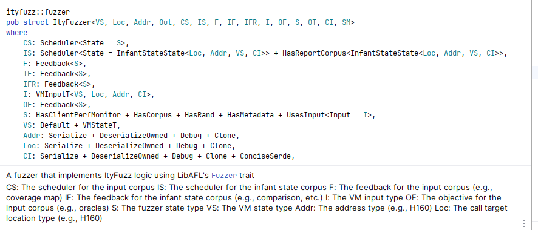

### src/mutation_utils.rs

定义了一些变异操作，对象通常是二进制数据，主要用于模糊测试中生成新的测试用例。
tuple_list包含：
1. `BitFlipMutator`：位翻转，对输入数据的某一位进行翻转操作。
2. `ByteFlipMutator`：字节翻转，对输入数据的某一字节进行翻转操作。
3. `ByteIncMutator`：字节增加，对输入数据的某一字节进行增加操作。
4. `ByteDecMutator`：字节减少，对输入数据的某一字节进行减少操作。
5. `ByteNegMutator`：字节取反，对输入数据的某一字节进行取反操作。
6. `ByteRandMutator`：随机字节，对输入数据的某一字节进行随机改变。
7. `ByteAddMutator`：字节加法，对输入数据的某一字节进行加法操作。
8. `WordAddMutator`：字增加，对输入数据的某一字进行增加操作。
9. `DwordAddMutator`：双字增加，对输入数据的某一双字进行增加操作。
10. `QwordAddMutator`：四字增加，对输入数据的某一四字进行增加操作。
11. `ByteInterestingMutator`：有趣的字节，对输入数据的某一字节进行“有趣”的改变。
12. `WordInterestingMutator`：有趣的字，对输入数据的某一字进行“有趣”的改变。
13. `DwordInterestingMutator`：有趣的双字，对输入数据的某一双字进行“有趣”的改变。
14. `BytesSetMutator`：设置字节，对输入数据的某些字节进行设置操作。
15. `BytesRandSetMutator`：随机设置字节，对输入数据的某些字节进行随机设置操作。
16. `BytesSwapMutator`：交换字节，对输入数据的两个字节进行交换操作。

代码其他部分包含：
17. `ConstantHintedMutator`：常量提示变异，将输入数据变异为合约中的一个常量。
18. `VMStateHintedMutator`：VM状态提示变异，将输入数据变异为VM状态中的一个值。
19. `BytesExpandMutator`：扩展字节，对输入数据进行扩展操作。
20. `BytesInsertMutator`：插入字节，对输入数据进行插入操作。
21. `BytesRandInsertMutator`：随机插入字节，对输入数据进行随机插入操作。
22. `BytesCopyMutator`：复制字节，对输入数据进行复制操作。

### fuzzers/evm_fuzzer.rs

* infant_scheduler——SortedDroppingScheduler————"基于投票机制丢弃输入（或VMState）的调度器"
* scheduler——PowerABIScheduler 对象，用于管理和调度模糊测试过程中的任务。作用是决定下一步要执行哪个输入或者测试用例，以及如何生成新的输入或者测试用例
* executor——evm_executor——EVM executor, wrapper of revm 
* artifacts——corpus_initializer————"corpus初始化器"，可能包含了一些在模糊测试中需要的信息，例如合约的字节码、ABI、初始状态等 
* instance_map——— ABI instance map from address，根据合约地址快速找到对应的合约实例 
* meta——将构建工件添加到元数据中，以便后续的代码可以根据地址快速查找到这些工件 
* cov_middleware——将每个合约的字节码添加到覆盖率中间件中，以便后续的代码可以根据地址快速查找到这些字节码
* feedback = MaxMapFeedback::new(&jmp_observer)——可能是用来观察和记录程序中的跳转指令的
* concolic_stage——符号执行阶段。在这个阶段中，将使用符号执行的方法来执行智能合约的代码，以寻找可能的错误或漏洞。
* std_stage——mutator——可能是一个阶段，用于执行模糊测试的某个特定步骤，例如变异输入
* state.metadata_map_mut().insert(UncoveredBranchesMetadata::new());可能用于跟踪和记录未覆盖的代码分支
* coverage_obs_stage——覆盖率观察阶段
* #[cfg(feature = "deployer_is_attacker")]——如果在编译时启用了 "deployer_is_attacker" 特性（例如，通过在编译命令中添加 --features deployer_is_attacker），那么这段代码就会被编译并执行。这段代码的作用是将 deployer 添加到状态的调用者列表中。这可能意味着在模糊测试或其他类型的测试中，deployer 被视为可能的攻击者。
* infant_feedback——CmpFeedback—
* infant_result_feedback——DataflowFeedback
* objective——OracleFeedback 对象，该对象用于在模糊测试过程中提供反馈
* wrapped_feedback—— ConcolicFeedbackWrapper 对象，该对象用于在模糊测试过程中提供反馈
* testcases——从指定的文件或目录中加载测试用例，并将其反序列化为 ConciseEVMInput 对象，然后将这些对象存储在 testcases 向量中。因此包含了从所有文件中加载的所有测试用例。
* load_code宏——加载给定的合约代码到 EVM 执行环境中。
* None => 执行模糊测试，否则执行回放测试

中间件（middleware）：
1. `Cheatcode`：这个中间件应该是第一个添加的，因为如果步骤是调用 `cheatcode_address`，那么这个步骤将被 "消耗"，并且对其他中间件不可见。
2. `OnChain`：如果配置中有 `onchain`，则会添加这个中间件。这个中间件用于处理链上的操作。
3. `Flashloan`：如果配置中启用了 `flashloan`，则会添加这个中间件。这个中间件用于处理闪电贷的操作。
4. `Sha3Bypass`：如果配置中启用了 `sha3_bypass`，则会添加这个中间件。这个中间件用于绕过 SHA3 的计算。
5. `ReentrancyTracer`：如果配置中启用了 `reentrancy_oracle`，则会添加这个中间件。这个中间件用于追踪重入攻击。
6. `Coverage`：这个中间件用于收集代码覆盖率信息。
7. `CallPrinter`：这个中间件用于打印调用信息。
以上是在 `evm_fuzzer` 函数中直接添加的中间件，实际上还可能通过配置添加其他的中间件，例如 `ArbitraryCallOracle`、`TypedBugOracle`、`SelfdestructOracle`、`ReentrancyOracle` 等。具体添加哪些中间件取决于配置和运行时的条件。

3个阶段
1. `concolic_stage`：符号执行阶段。在这个阶段中，将使用符号执行的方法来执行智能合约的代码，以寻找可能的错误或漏洞。
2. `std_stage`：模糊测试阶段。在这个阶段中，将使用模糊测试的方法来执行智能合约的代码，以寻找可能的错误或漏洞。
3. `coverage_obs_stage`：覆盖率观察阶段。在这个阶段中，将使用覆盖率观察的方法来执行智能合约的代码，以寻找可能的错误或漏洞。

6个oracles
1. `EchidnaOracle`：这个对象的构造函数接受两个参数：一个地址到 ABI 的映射，其中只包含函数名以 "echidna_" 开头且 ABI 为 "()" 的函数；一个函数签名到函数名的映射，其中只包含函数名以 "echidna_" 开头且 ABI 为 "()" 的函数。
2. `InvariantOracle`：这个对象的构造函数接受两个参数：一个地址到 ABI 的映射，其中只包含函数名以 "invariant_" 开头且 ABI 为 "()" 的函数；一个函数签名到函数名的映射，其中只包含函数名以 "invariant_" 开头且 ABI 为 "()" 的函数。
3. `ArbitraryCallOracle`：
4. `TypedBugOracle`：
5. `SelfdestructOracle`：
6. `ReentrancyOracle`：

4个反馈
1. wrapped_feedback, 
2. infant_feedback, 
3. infant_result_feedback, 
4. objective,

#### 模糊测试函数：

`let mut vm_state = initial_vm_state.clone();`：克隆初始的虚拟机状态。
`for txn in testcase {`：遍历测试用例中的每个交易。
`load_code!(txn);`：加载交易中的合约代码。
`let (inp, call_until) = txn.to_input(vm_state.clone());`：将交易和当前的虚拟机状态转换为输入。
`unsafe { CALL_UNTIL = call_until; }`：设置全局变量 `CALL_UNTIL` 的值。
`fuzzer.evaluate_input_events(state, &mut executor, &mut mgr, inp, false).unwrap();`：使用模糊测试器评估输入。
`vm_state = state.get_execution_result().new_state.clone();`：更新虚拟机状态。
`let res = fuzzer.fuzz_loop(&mut stages, &mut executor, state, &mut mgr);`：执行模糊测试循环。
 `let rv = res.err().unwrap().to_string();`：获取模糊测试循环的结果。
`if rv == "No items in No entries in corpus" {`：如果结果为 "No items in No entries in corpus"，则打印错误信息并退出。

#### 回放测试

`unsafe { EVAL_COVERAGE = true; }`：设置全局变量 `EVAL_COVERAGE` 的值为 `true`。
`let printer = Rc::new(RefCell::new(CallPrinter::new(artifacts.address_to_name.clone())));`：创建一个新的 `CallPrinter` 对象。
`evm_executor_ref.borrow_mut().host.add_middlewares(printer.clone());`：将 `CallPrinter` 对象添加到中间件列表中。
`for testcase in testcases {`：遍历所有的测试用例。
`let mut vm_state = initial_vm_state.clone();`：克隆初始的虚拟机状态。
`for txn in testcase {`：遍历测试用例中的每个交易。
`load_code!(txn);`：加载交易中的合约代码。
`let (inp, call_until) = txn.to_input(vm_state.clone());`：将交易和当前的虚拟机状态转换为输入。
`printer.borrow_mut().cleanup();`：清理 `printer` 对象。
`unsafe { CALL_UNTIL = call_until; }`：设置全局变量 `CALL_UNTIL` 的值。
`fuzzer.evaluate_input_events(state, &mut executor, &mut mgr, inp, false).unwrap();`：使用模糊测试器评估输入。
`vm_state = state.get_execution_result().new_state.clone();`：更新虚拟机状态。
`cov_middleware.borrow_mut().record_instruction_coverage();`：记录指令覆盖率。

### fuzzer.rs
A fuzzer that implements ItyFuzz logic using LibAFL's [`Fuzzer`] trait 

* VS: The VM state type
* Loc: The call target location type (e.g., H160)
* Addr: The address type (e.g., H160)
* Out 
* CS: The scheduler for the input corpus
* IS: The scheduler for the infant state corpus
* F: The feedback for the input corpus (e.g., coverage map)/////wrapped_feedback,
* IF: The feedback for the input state and execution result in infant state (e.g., comparison, etc.)////infant_feedback,
* IFR: The feedback for the resultant state to be inserted into infant state/// corpus (e.g., dataflow, etc.)////infant_result_feedback,
* I: The VM input type
* OF: The objective for the input corpus (e.g., oracles) ~~////oracle feedback~~
* S: The fuzzer state type
* OT
* CI
* SM
* minimizer_map——"从测试用例的哈希映射（例如，覆盖率图）到（测试用例索引，喜好因子）用于最小化语料库"

### 测试结果：

### 问题

`for (i, testcase) in testcases.iter().enumerate() {
info!("============ Testcase {}: {:?}", i, testcase);
// println!("Testcase {}: {:?}", i, testcase);
for (j, txn) in testcase.iter().enumerate() {
info!("Transaction {} in Testcase {}: {:?}", j, i, txn);
// println!("Transaction {} in Testcase {}: {:?}", j, i, txn);
}
}`不打印

### 其他
1.fuzzer.rs/should_replace函数
用于确定是否应该替换一个测试用例。它首先生成测试用例的覆盖率数据的哈希值，然后查看minimizer_map中是否有相同的哈希值。如果有，并且新的测试用例的"fav factor"大于旧的测试用例的"fav factor"，那么就返回一个元组，包含哈希值、新的"fav factor"和旧的测试用例的索引，表示应该替换旧的测试用例。如果没有找到相同的哈希值，或者新的测试用例的"fav factor"不大于旧的测试用例的"fav factor"，那么就返回None，表示不应该替换旧的测试用例。
是否可以先比较fav factor的值，然后在比较覆盖率？？？